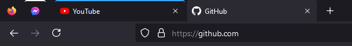
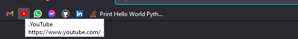

# Firefox UI Tweaks

Firefox UI Tweaks fixes the look of tabs, removing the need to expend extra brain power to find your current tab. Additionally, it adds optional quality of life tweaks.

## Features

### Make tabs more compact and merge them cleanly with the address bar

### Hide bookmark names preceeded with '.' to keep bookmarks more compact

## Installation

### 1. Enable userChrome customisation in about:config

1. Navigate to `about:config` in the address bar and accept the risks.
2. Search for `toolkit.legacyUserProfileCustomizations.stylesheets` and toggle it to `true` (by double clicking on it).

### 2. Locate and open your profile folder

Either of the following two methods work:

- Using the Firefox troubleshooting page
  1. Click on **☰ ➝ Help ➝ Troubleshooting** Information or navigate to `about:support` in your address bar
  2. Under **Application Basics**, click on the the **Open Folder** button. You should now see your profile folder.

- Using the Firefox command line
  1. Press **Shift+F2**
  2. Enter the command ``folder openprofile``

### 3. Create the folder and its files

1. Inside your **profile** folder, create a new folder named `chrome` (all lower case)

2. Inside the **chrome** folder, copy the `userChrome.css` from this repository, or create a symlink to it with the same name (case sensitive)

*These are modified instructions from the [Firefox subreddit](https://www.reddit.com/r/firefox/wiki/userchrome)*

## Usage

Feel free to comment out or edit bits you don't like
